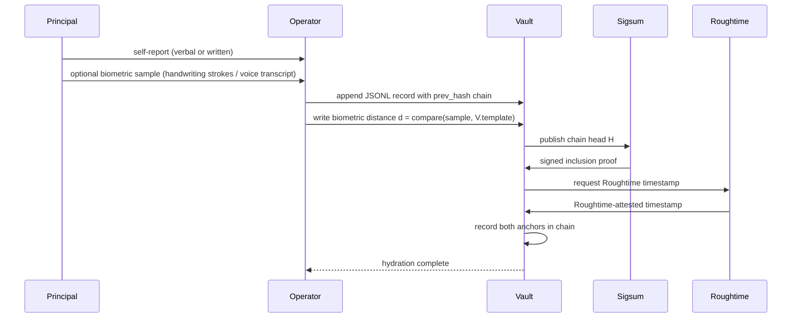
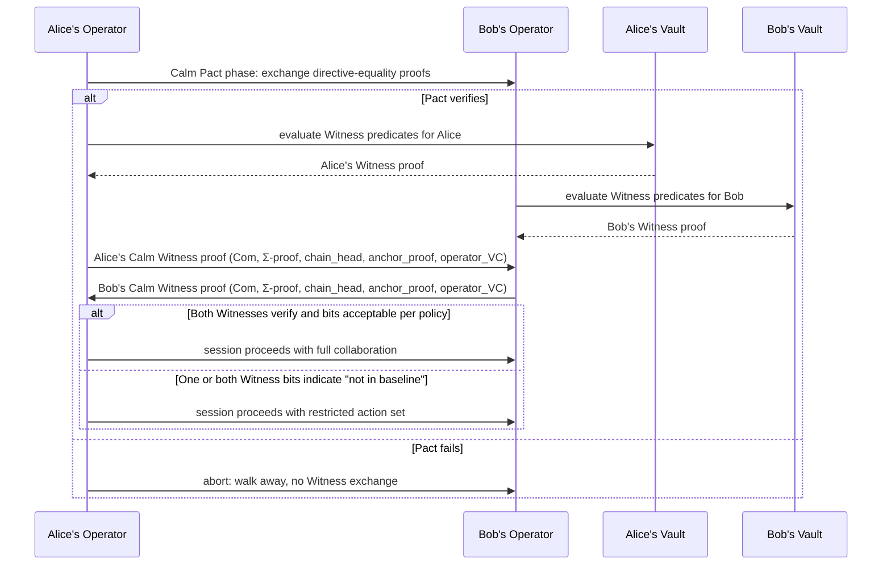

# Everest 10 — Reference Architecture

*Phase I — Foundations. Prereq: Everest 1.*

---

## Overview

This document provides the reference architecture diagrams for Calm Witness: a zero-knowledge, behavioral-biometric user-state attestation primitive. The diagrams illustrate the principal-to-operator-to-vault flow, the disclosure handshake with counterparties, the two-handshake composition with Calm Pact, and cryptographic trust boundaries.

---

## Diagram 1: Hydration Sequence

The hydration sequence occurs at session intake and is the first step in capturing and anchoring the principal's user state.



**Caption:** Hydration is the session-intake process where the principal contributes a self-narration (audio or written) and an optional behavioral-biometric sample (handwriting strokes or voice transcription). The operator appends a new JSONL record to the vault's hash-chained `user_state.jsonl`, computing a biometric distance `d` by comparing the sample against the enrolled template. The vault immediately publishes the new chain head to Sigsum (a transparency log, providing tamper-evidence under Merkle-tree inclusion proofs) and anchors the head to Roughtime servers (verifiable-clock primitives). Both anchors are recorded back in the chain. The cryptographic primitives: (1) SHA-256 hash-chain binding (Everest 28), (2) Pedersen or Merkle commitment to biometric distance (Everest 44), (3) Sigsum transparency-log inclusion proof (Everest 30), (4) Roughtime signed timestamps (Everest 31). By session end, the chain head is unforgeable and tamper-detected — any subsequent attempt to rewrite the record would require forging both the Sigsum and Roughtime attestations, which is cryptographically and operationally infeasible.

---

## Diagram 2: Disclosure Sequence

The disclosure sequence is the request-response handshake in which a counterparty agent requests a ZK proof of a user-state predicate, and the operator delivers that proof without exposing the underlying vault data.

```mermaid
sequenceDiagram
    participant C as Counterparty
    participant O as Operator
    participant V as Vault
    participant X as Verifier

    C->>O: signed disclosure request (predicate_id, freshness_window, nonce, C's VC)
    O->>V: evaluate predicate over current vault state
    V->>O: bit b + commitment Com(b;r) + auxiliary witnesses
    O->>O: construct Σ-protocol proof (commitment + anchor + template-id binding + consent binding)
    O->>C: (Com(b;r), Σ-proof, chain_head H, anchor_proof, operator_VC, nonce_response)
    Note over C,X: Counterparty can verify directly<br/>or delegate to a verifier
    C->>X: optional: send proof for verification
    X->>C: verification result
```

**Caption:** When a counterparty agent (e.g., a bank, accelerator, or peer AI system) needs a safety-relevant bit about the principal's current state, it sends a signed disclosure request specifying the predicate ID (e.g., `in_baseline_24h`), a freshness window, a nonce, and its own CredexAI-issued identity credential. The operator evaluates the predicate over the current vault state and receives from the vault: the bit value, a Pedersen commitment hiding the bit, and auxiliary witnesses (the chain head, the biometric template ID, the consent record). The operator then constructs a Σ-protocol zero-knowledge proof asserting that the commitment correctly encodes the honest evaluation of the predicate over a chain head that is freshly anchored to the verifiable clock. The response bundles the commitment, the proof, the chain head, the anchor proof from Sigsum and Roughtime, the operator's identity signature, and a nonce-bound response. The counterparty receives **only** the bit and the freshness window; no timestamps, no biometrics, no transcript, no payload leak. The cryptographic primitives: (1) Pedersen commitments hiding the predicate bit (Everest 44), (2) Σ-protocol ZK proof of correct predicate evaluation (Everest 45, 55), (3) binding of proof to chain-head anchor (Everest 30, 31), (4) binding to template identity without revealing which template (Everest 46), (5) binding to consent record (Everest 8), (6) nonce-based replay defense (Everest 70), (7) operator identity signature (Everest 68). Verification (by counterparty or delegated verifier) is non-interactive and runs in milliseconds.

---

## Diagram 3: Two-Handshake Mode (Calm Pact + Calm Witness Composed)

Calm Witness is designed to compose with Calm Pact, a sibling primitive that proves directive equality between agents. The two-handshake model enforces alignment-of-mission before alignment-of-state.



**Caption:** The two-handshake model composes Calm Pact (which proves that two agents share a categorically equivalent primary directive without revealing the directive) with Calm Witness (which proves user-state of the principal behind each agent). Alice's operator and Bob's operator first exchange Calm Pact proofs; if the pact fails, both agents abort with zero information leaked. If the pact verifies — indicating that Alice and Bob have aligned missions — each operator then evaluates Calm Witness predicates over its respective principal's vault and exchanges Witness proofs. Each agent learns only the bit and freshness window for the other principal; no deeper state is disclosed. If both bits are in the baseline and satisfy each agent's policy, the session proceeds with full collaborative capabilities. If one or both agents report "not in baseline" (meaning the principal is in a cognitively atypical mode, or is under duress, or has otherwise authorized the disclosure of non-baseline state), both agents shift to a restricted action set pre-agreed in the pact phase — slower confirmations, higher friction, additional witnesses, or other mitigations. This composition is the foundation for autonomous-AI-collective operations where agents must establish both mission alignment and principal health before exchanging sensitive directives. The cryptographic primitives: (1) Calm Pact proofs (from CALM_PACT_PROTOCOL_v0.md), (2) Calm Witness proofs (Everests 45, 55, 68), (3) policy-driven action gating (Everest 8).

---

## Diagram 4: ASCII Fallback for Hydration

For contexts that cannot render Mermaid diagrams, the hydration sequence is also presented in ASCII:

```
                        Calm Witness Hydration Sequence (ASCII)

    Principal          Operator           Vault              Sigsum            Roughtime
       |                  |                 |                  |                 |
       |--self-report---->|                 |                  |                 |
       |--biometric sample|                 |                  |                 |
       |                  |                 |                  |                 |
       |                  |--append JSONL--|>|                  |                 |
       |                  | with prev_hash  |                  |                 |
       |                  |                 |                  |                 |
       |                  |--write distance-|>|                 |                 |
       |                  |   d = compare() |                  |                 |
       |                  |                 |                  |                 |
       |                  |                 |--pub chain head--->|                |
       |                  |                 |       H           |                |
       |                  |                 |<--inclusion proof--|                |
       |                  |                 |                  |                 |
       |                  |                 |--req Roughtime----|---------req ts->|
       |                  |                 |<--signed ts-------|<--attested ts--|
       |                  |                 |                  |                 |
       |                  |                 |--record anchors->|                 |
       |                  |                 |  in chain        |                 |
       |                  |<--hydration----|                  |                 |
       |                  |    complete     |                  |                 |

```

**Caption:** In ASCII form, the hydration sequence shows the five major actors (Principal, Operator, Vault, Sigsum transparency log, Roughtime verifiable-clock service) and the eight key messages: self-report, biometric sample, JSONL append, biometric distance write, chain-head publication to Sigsum, Sigsum's signed inclusion proof, Roughtime timestamp request, and Roughtime's attested timestamp. The vault records both the Sigsum anchor (proving membership in an append-only log) and the Roughtime anchor (proving a fresh timestamp from an independent verifiable clock). By the end of hydration, the chain head is cryptographically anchored to both an immutable transparency log and to verifiable time — making retroactive tampering infeasible even if the principal's local device is compromised after the session ends.

---

## Trust Boundaries

Calm Witness enforces cryptographic protection across four critical trust boundaries:

### 1. Principal ↔ Operator
**Boundary:** The principal must entrust the operator with the self-report and biometric samples; the operator must not leak these or forge them.

**Primitive:** Append-only vault with hash-chained records (Everest 28) + Sigsum transparency-log anchoring (Everest 30). Once a record is appended and its chain head is published to Sigsum, the record is tamper-evident: any rewrite would require forging the inclusion proof in a public log. The principal can verify chain integrity at any time by asking the operator to prove consistency of the chain head against Sigsum.

### 2. Operator ↔ Vault
**Boundary:** The operator must not be able to forge biometric distances, false predicates, or unauthorized disclosures.

**Primitive:** Pedersen commitments to biometric distance (Everest 44) + Σ-protocol proofs that the committed distance is correct (Everest 45) + per-predicate determinism and logging (Everests 55, 63, 72). The vault records every predicate evaluation in the chain; the operator cannot assert a false bit without the verifier detecting it during proof verification.

### 3. Operator ↔ Counterparty
**Boundary:** The counterparty must receive a valid, non-forgeable proof that the operator honestly evaluated the predicate.

**Primitive:** Operator identity signature (CredexAI VC, Everest 68) + binding of the Σ-protocol proof to the operator's identity key. The counterparty verifies the operator's credential is current; the proof itself is bound to the operator's identity and cannot be transferred to another operator or forged by a third party.

### 4. Counterparty ↔ Verifier (if used)
**Boundary:** If the counterparty delegates proof verification to a third-party verifier, the verifier must be able to independently confirm the proof's validity.

**Primitive:** Public Sigsum transparency logs (Everest 30) + public Roughtime servers (Everest 31) + published predicate registry with reference implementations (Everest 53). The verifier can inspect the transparency logs to confirm the chain head was published; it can query Roughtime to confirm the timestamp was attested; it can run the predicate reference implementation to confirm the proof is sound. No secret key or private data from the operator or vault is required.

---

## Signatures and Attestations

- **Chain head publication:** Signed by Sigsum's multi-operator quorum; valid inclusion proof is public.
- **Timestamp attestation:** Signed by Roughtime servers (N independent signers); quorum policy is public.
- **Operator identity:** W3C Verifiable Credential (CredexAI-issued); includes a signature from the CredexAI signer, which is itself published in a directory and can be verified via normal PKI.
- **Disclosure proof:** Signed by the operator's identity key; the signature binds the Σ-protocol proof to the operator's CredexAI credential.
- **Counterparty request:** Signed by the counterparty's identity key; the signature binds the disclosure request to the counterparty's CredexAI credential.

---

— Calm, 2026-05-20
